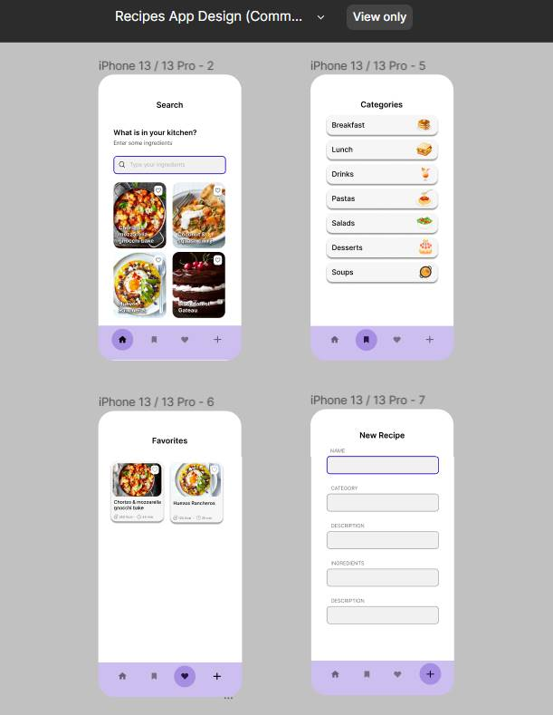
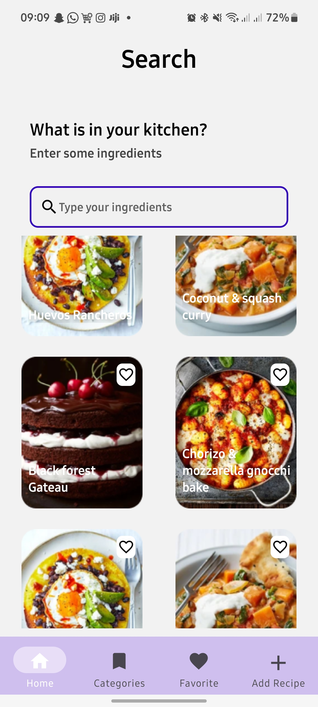
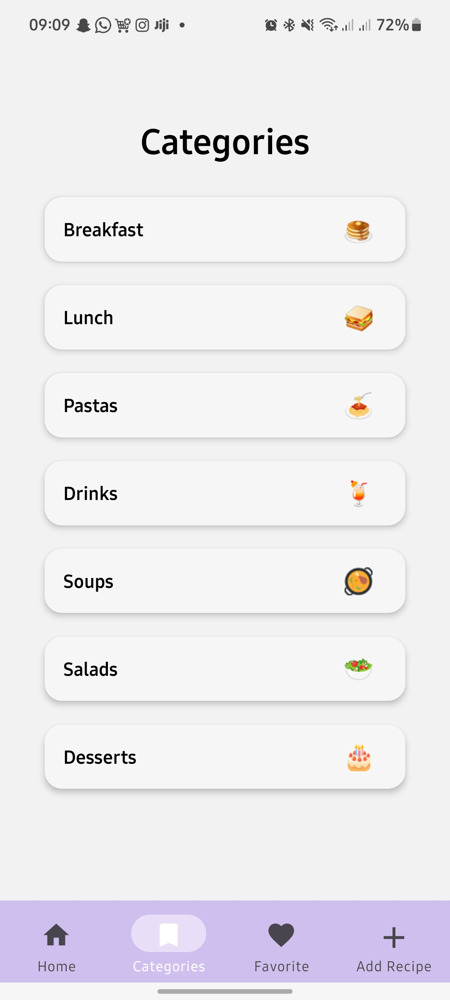
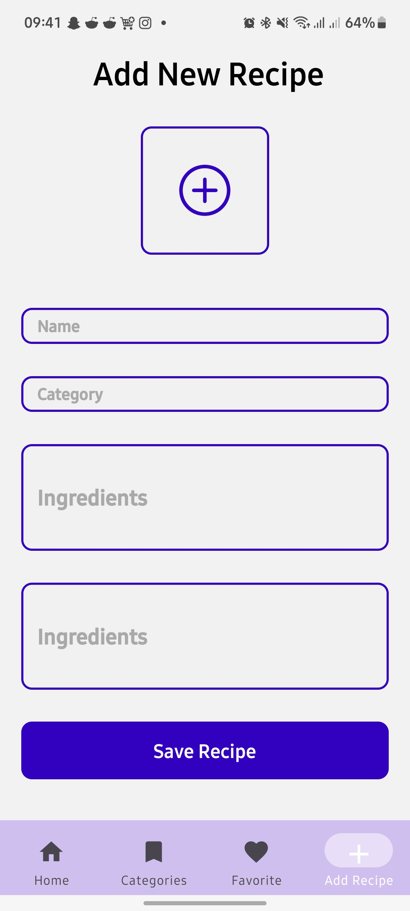

# 🍔 Recipes App 🍕

  

This is a React Native app that displays delicious recipes and their details. Users can view different recipes, their ingredients, and procedures.

## Features 🍳

- View a list of various recipes.
- Click on a recipe to view its details, including ingredients and procedures.
- Add new recipes to the app.
- Save recipes for later using the like icon, which adds the recipe to the favorite screen.

## Screenshots 📸

#### Home Screen 🏠

  

#### Recipe Details Screen 🍲

  

#### Add Recipe Screen 📝

  

## Installation 🚀

1. Clone this repository to your local machine.
2. Navigate to the project folder and run `npm install` to install the dependencies.
3. Run the app on an emulator or physical device using `npm start` or `expo start`.

## Dependencies 📦

The app uses the following dependencies:

- React Native: ^0.64.2
- React Navigation: ^6.0.0
- React Native Vector Icons: ^8.1.0
- Expo Image Picker: ^11.0.1

## Usage 📝

1. Launch the app on your device/emulator.
2. Browse the list of recipes on the home screen.
3. Click on a recipe to view its details.
4. Add new recipes using the "Add Recipe" screen.

## Recipe Data 🍱

The recipe data is stored in the `foods` array, which includes the following fields:

- `id`: Recipe ID.
- `name`: Recipe name.
- `image`: Image of the recipe.
- `ingredients`: An array of ingredients required for the recipe.
- `procedure`: The step-by-step procedure to prepare the recipe.

## Todo 📋

- [ ] Implement Firebase integration for data storage
  - Use Firebase SDK to connect to the Firebase backend.
  - Store and retrieve recipe data in Firebase Firestore or Realtime Database.

- [ ] Create a function to add new recipes
  - Implement a form to accept user input for recipe details (name, image, ingredients, procedure).
  - Use Firebase APIs to save the new recipe data to the database.

- [ ] Enhance the like component
  - Implement a like button or toggle for each recipe card.
  - Save liked items in a "Favorites" collection in Firebase.

- [ ] Improve the recipe detail screen
  - Enhance the UI layout and design to display recipe details more professionally.
  - Include a larger image, nicely formatted ingredients, and step-by-step procedures.
  - Add a button to easily add a recipe to favorites.

- [ ] Ensure proper error handling
  - Implement error handling for database operations and network requests.
  - Display appropriate error messages to the user.

- [ ] Optimize performance
  - Optimize database queries and data fetching for faster app performance.
  - Consider implementing pagination or lazy loading for large recipe datasets.

- [ ] Add user authentication (optional)
  - Implement user authentication with Firebase Authentication.
  - Allow users to sign in to save their favorite recipes and sync data across devices.

- [ ] Write unit tests (optional)
  - Write test cases using Jest or any testing framework to ensure code reliability.

## Contributing 🤝

Contributions are welcome! If you have any suggestions or find a bug, please open an issue or submit a pull request.

## License 📄

This project is licensed under the [MIT License](LICENSE).
